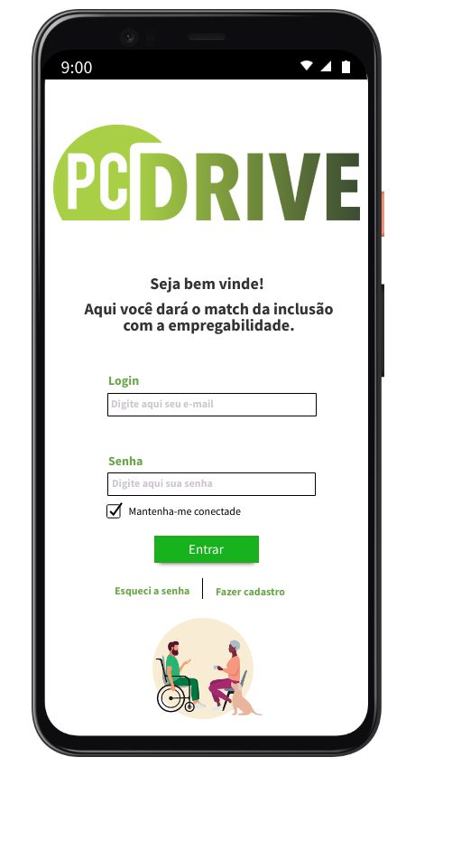

# Projeto PCDRIVE

<Logotipo com o nome pcdrive com fundo branco e letras de cor verde e sombreamento escuro>

-----------------------
# Índice 

* [Descrição do Projeto](#descrição-do-projeto)
* [Esquema de API](#esquema-de-api)
* [Tecnologias Utilizadas](#tecnologias-utilizadas)
* [Pacotes Utilizados](#pacotes-utilizados)
* [Métodos e Rotas](#métodos-e-rotas)
* [Status do Projeto](#status-do-projeto)
* [Projetos Futuros](#projetos-futuros)
* [Acesso ao Projeto](#acesso-ao-projeto)
* [Agradecimentos](#agradecimentos )

## Descrição do Projeto

O projeto PCDrive foi criado visando ajudar pessoas com deficiência que procuram oportunidades de emprego, diante da grande dificuldade motivada pela falta de programas de inclusão e o pouco conhecimento das empresas em saber como encontrar e recrutar candidates com deficiência.

Segundo a pesquisa da Santo Caos em parceria com a Catho realizada em 2019 (com mais de 1.000 respondentes), 34% dos profissionais com deficiência se sentem isolados no ambiente de trabalho, percepção que reforça a lacuna de investimento das empresas a respeito do tema. Outros pilares também foram observados, tais como ausência de: compartilhamento (37%), compromisso (17%) e orgulho (11%). 

O pcDrive se apresentará num formato de aplicativo híbrido, atendendo necessidades tanto para acesso web quanto para acesso por smartphones.
 
 
-----------------------------------

## Esquema de API

A API irá armazenar dados importantes de candidatxs, suficiente para suprir as informações necessárias para uma empresa se interessar e contactar para participar de um processo seletivo. Também irá armazenar dados das empresas cadastradas e que querem divulgar seu interesse em investir na diversidade.

Será utilizado duas schemas:

| CANDIDATE     | EMPRESAS       |
| ------------- | -------------- |
| id            |  id            |
| name          |  companyName   |
| birth         |  fantasyName   |
| genre         |  cnpj          |
| deficiency    |  occupationArea|
| breed         |  city          |
| city          |  phone         | 
| schooling     |  email         |
| language      |  userName      |
| experience    |      -         |
| area          |      -         |
| phone         |      -         |
| email         |      -         |
| status        |      -         |        

-----------------------------------

## Tecnologias Utilizadas
 
* Git
* Node.js
* MongoDB
* Heroku
* Postman

---------------------------------------

## Pacotes Utilizados

* nodemon
* express
* mongoose

------------------------------------------

## Métodos e Rotas

Por meio dos métodos HTTP, será manipulado os dados de acordo com a necessidade dos usuários.

No usuário Candidates, os métodos e rotas serão:

| MÉTODO |     ROTA             |             AÇÃO              |
|------- | -------------------  | ------------------------------|
|GET     | /candidate           |   Exibir todos os candidatos  |
|GET     | /candidate/:id       |   Exibir candidatos por Id    |
|GET     | /candidate/area      |   Exibir candidatos por área  |
|GET     | /candidate/experience|   Exibir candidatos experientes|
|POST    | /candidate           |   Cadastrar candidatos        |
|DELETE  | /candidate/:id       |   Excluir empresas            |
|PUT     | /candidate/:id       |   Alterar/atualizar candidatos|

No usuário Companies, os métodos e rotas serão:

| MÉTODO |     ROTA         |             AÇÃO              |
|------- | ------------     | ------------------------------|
|GET     | /companies       |   Exibir todas as empresas    |
|GET     | /companies:id    |   Exibir empresas por ID      |
|GET     | /companies/city  |   Exibir por cidade           |
|POST    | /companies       |   Cadastrar empresas          | 
|DELETE  | /companies:id    |   Excluir empresas            |
|PUT     | /companies:id    |   Alterar/atualizar empresas  |

-----------------------------------
### Status do Projeto
 
:construction: Projeto em construção :construction:
 
 
-----------------------------------
## Projetos Futuros
 
 

 
 
 
Será desenvolvido a versão mobile do aplicativo pcDrive.
O projeto contará com a participação de profissionais para estudos de UI/UX Design e desenvolvimento da stack Front-End.

-----------------------------------
## Acesso ao Projeto
 
Gostaria de contribuir/sugerir melhorias para o projeto?

* Crie um fork do projeto

* Crie uma branch chamada feature/seu-nome

* Faça suas contribuições 

* Faz o commit (quantos precisar)

* Abre um pull request :)

-----------------------------------
#### Agradecimentos 

* Gratidão a todas as mulheres incríveis do {reprograma} e Porto MINAS (Facilitadora, psicóloga, professoras, monitoras e palestrantes), que tocam um projeto necessário para diminuir o gap de gênero e incluir mulheres na tecnologia.*

* Gratidão as minhas colegas da turma on7-porto, um verdadeiro significado de sororidade e rede de apoio. Em especial agradeço a Giselle Oliveira, pela parceria durante os 5 meses de curso.*

* Gratidão a Rafaella França, namorada e parceira no processo de desenvolvimento deste projeto, e a minha família.*

--------------------------------

*Autora: Tereza Oliveira*

*fonte:https://www.catho.com.br/carreira-sucesso/colunistas/noticias/obstaculos-da-inclusao-pcd-no-mercado-de-trabalho/*

#### Projeto apresentado no dia 13/12/2020, projeto em processo de modificação.
